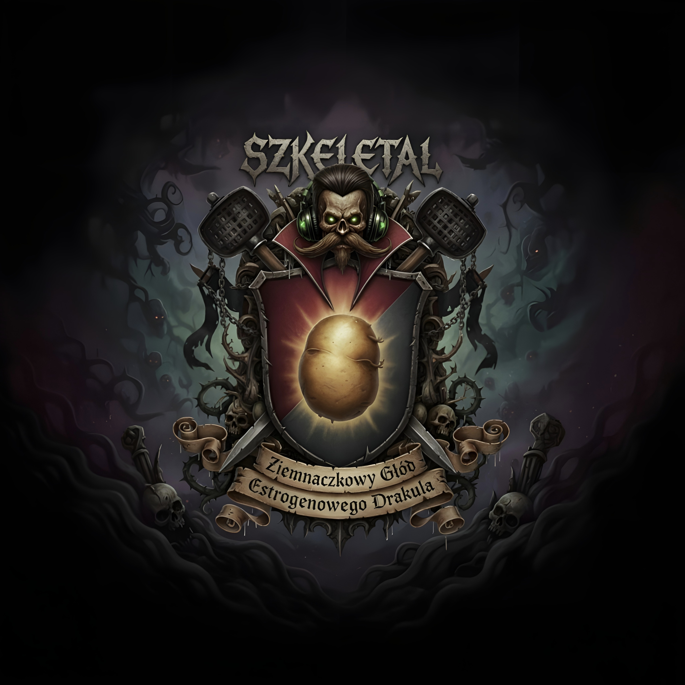
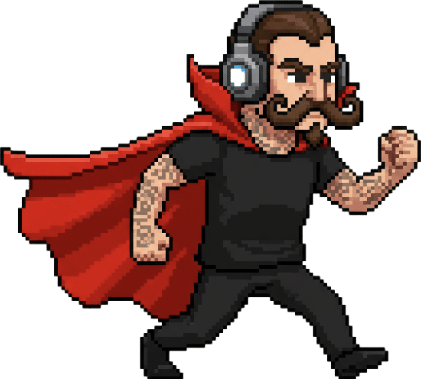
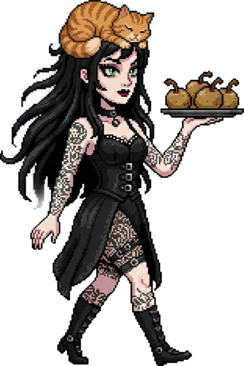

<div align="center">
  
  
  # Szkeletal 🦇🥔
  **Dynamic, fast-paced 2D Bullet Hell Survivor built entirely in Vanilla JS/HTML5/CSS3.**

  []()
  []()
  []()
</div>

---

## 🎮 About the Game
**Szkeletal** is an intense, retro-styled roguelite survival game throwing you into the shoes of the notorious Count Dracula (Drakul) surviving against endless hordes of 'Haters'. 
Battle your way through dynamic waves of enemies, dodge explosive *Potato Bombs*, collect magical *Gems*, and harness powerful *Orbits*, *Lightning*, and *Whips*.

### 🌟 Key Features
* ⚔️ **Endless Hordes & Bullet Hell**: Survive against dense waves of thousands of dynamic physics-based entities.
* 💀 **Challenging Bosses**: Face off against iconic elites like *The Lumberjack*, *SnakeEater*, and the explosive *Amenda*.
* 🔫 **Synergistic Perks System**: Evolve your weaponry (Autogun, Whip, Nova, Chain Lightning, Orbital Potatoes) and unlock passive stats in the Shop.
* 🌍 **Vast Dynamic Maps**: Destructible environments containing Shrines, Huts, Trees, and treacherous Cesspools.
* 🎨 **Retro Aesthetics**: Custom crafted pixel-art sprites, fluid animations, vignette lighting, and deep color palettes.
* 🕹️ **Controller Support**: Full Gamepad and Touch Joystick functionality.
* 🌐 **Multi-Language**: Fully localized in English, Polish, and Romanian.

---

## 📸 Media
<p align="center">
  
  
</p>

## 🚀 Quick Start
To run the game locally, you don't need any complex build systems. Just launch a local server!

1. **Clone the repository:**
   ```bash
   git clone https://github.com/your-username/szkeletal.git
   cd szkeletal
   ```

2. **Run a local web server** (e.g., using Python):
   ```bash
   python3 -m http.server 8000
   ```

3. **Play:**
   Open your browser and navigate to `http://localhost:8000`.

---

## 🛠️ Tech Stack & Architecture
* **Frontend:** Pure HTML5 `<canvas>`, CSS3, and Vanilla ES6+ JavaScript.
* **Architecture:** Custom Entity-Component-System (ECS) inspired game loop with object pooling for maximum performance (60+ FPS at thousands of entities).
* **AI Vibe Coding:** Features and content accelerated through AI-assisted Vibe Coding.
* **Assets:** Custom `AssetManager` loading and caching sprites and localized text instantly.
* **No Dependencies:** Zero external frameworks or libraries!

---
<div align="center">
  <i>"Niegdyś wybranka Hrabiego... Teraz w akcie pogardy powraca z patoświata, by rzucać w niego wybuchowymi kartoflami!"</i> 🥔
</div>
